# NotePad
实现以下功能：
* NoteList界面中笔记条目增加时间戳显示
* 添加笔记查询功能（按照标题查询）
* 笔记分类添加标签
* UI美化

## 一 NoteList界面中笔记条目增加时间戳显示
### 1、首先对notes_list_item.xml中加入一个TextView由于显示时间戳
设置一个TextView并与原本标题的TextView（id为"@android:id/text1"）在一个垂直分布的线性布局下。
```
<TextView
    android:id="@+id/modified_date"
    android:layout_width="wrap_content"
    android:layout_height="wrap_content"
    android:gravity="right"
    android:text="time"
    android:textSize="15sp" />
```
这是新的notes_list_item.xml的样式，左下角显示时间戳
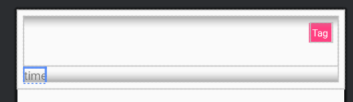
### 2、在NotesList的Activity中设置ListView新的item的配置显示，增加时间戳的配置。
#### (1)查询时间戳
首先为了能够获取到时间戳，在NotesList的PROJECTION中添加`NotePad.Notes.COLUMN_NAME_MODIFICATION_DATE, //2`以查询到修改时间。
#### (2)装配adapter以符合新的item布局
由于添加了修改时间，我们通过修改dataColumns和viewIDs添加一个对时间戳的from和to，来配置到新的item布局中。
```
String[] dataColumns = { NotePad.Notes.COLUMN_NAME_TITLE, NotePad.Notes.COLUMN_NAME_MODIFICATION_DATE};
int[] viewIDs = { android.R.id.text1, R.id.modified_date};
```
#### (3)存在问题：时间戳显示并非年月日时分秒，而是毫秒数
由于Notes表格中存入的是System.currentTimeMillis()，显示的是一串长数字（如下图），代表从1970年1月1日开始计算的总毫秒数。


为了直观看到笔记编辑的条目时间，我们追寻到创建和编辑笔记时，在何时添加的修改时间，因此我们在NoteEditor中寻找代码逻辑，最终发现在NoteEditor中，不论是`mState == STATE_EDIT`还是`mState == STATE_INSERT`都会调用updateNote方法，在updateNote方法中，下列代码存入了当前时间的系统时间毫秒数
```
ContentValues values = new ContentValues();
values.put(NotePad.Notes.COLUMN_NAME_MODIFICATION_DATE, System.currentTimeMillis());
```
#### (4)修改时间戳的存储
我们通过SimpleDateFormat对这个时间毫秒数进行format化，对`System.currentTimeMillis()`进行规范化后，将规范化后的formattedDate存入到数据库中
```
SimpleDateFormat dateFormat = new SimpleDateFormat("yyyy-MM-dd HH:mm:ss");
String formattedDate = dateFormat.format(new Date(System.currentTimeMillis()));
ContentValues values = new ContentValues();
values.put(NotePad.Notes.COLUMN_NAME_MODIFICATION_DATE, formattedDate);
```
### 结果
最终实现时间戳的显示为"yyyy-MM-dd HH:mm:ss"格式


## 二 添加笔记查询功能（按照标题查询）
### 1、首先在NotesList的布局中添加一个SearchView
#### (1)存在问题：NotesList是继承ListActivity的Activity，它并没有布局
分析代码发现，在NotesList中并没有setContentView方法来绑定一个布局，布局文件中也没有对应的布局，因此我们需要自己创建一个NotesList布局，里面包含ListView以及我们要实现的搜索功能的组件SearchView
##### 仍存在问题一：通过自己设置布局来绑定到NotesList，启动app会报错闪退
**解决** ListActivity自身就有一个布局，其布局中包含一个ListView。如果要对ListActivity设置布局，就需要对我们设置的布局里面的ListView的id设置为`android:id="@android:id/list"`。
```
        <androidx.appcompat.widget.SearchView
            android:layout_width="match_parent"
            android:layout_height="wrap_content"
            android:id="@+id/Search" />

        <ListView
            android:layout_width="match_parent"
            android:layout_height="0dp"
            android:layout_weight="1"
            android:id="@android:id/list" />
```
##### 仍存在问题二：启动app仍然会报错闪退
**发现原因** 根据LogCat的报错发现，SearchView并不支持AppCompat或Material以外的主题。

**解决** 因此，在AndroidManifest.xml文件中，添加theme
```
<application
    android:icon="@drawable/app_notes"
    android:label="@string/app_name"
    android:theme="@style/Theme.AppCompat.DayNight.DarkActionBar">
```
##### 仍存在问题三：启动app后发现，在这个主题下，ActionBar消失了
明明采用的是DarkActionBar的主题，可是对应的ActionBar却消失
**解决** 这里我们采用ToolBar来代替ActionBar
首先在noteslist_layout.xml中加入一个ToolBar，在线性布局的垂直布局下，第一栏最顶部添加ToolBar
```
<android.widget.Toolbar
    android:id="@+id/toolbar"
    android:layout_width="match_parent"
    android:layout_height="wrap_content"
    android:background="@color/LightGray"
    android:theme="@style/Theme.AppCompat.DayNight.DarkActionBar"/>
```
然后在NotesList中实现一个initView()方法，在initView方法中获取toolbar然后通过setActionBar()方法，将toolbar与ActionBar设置，以匹配ActionBar，将其对应的菜单也实现在ToolBar上
```
toolbar = findViewById(R.id.toolbar);
setActionBar(toolbar);
```
#### 最终布局效果
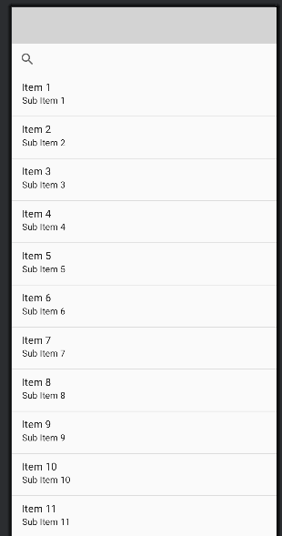
### 2、在NotesList实现SearchView的功能
#### (1)细节设置
通过setIconifiedByDefault()方法设置searchview的searchbox默认显示，否则需要点击放大镜icon才会显示searchbox。
通过setSubmitButtonEnabled()方法添加一个提交按钮（箭头），当用户focus输入的box后会出现这个箭头。
```
searchView.setIconifiedByDefault(false);
searchView.setSubmitButtonEnabled(true);
```

#### (2)对SearchView的搜索功能编辑
对于SearchView需要实现onQueryTextSubmit()方法用于对输入的文本提交的进行的逻辑操作以及onQueryTextChange()方法用于对输入的文本发生改变的进行的逻辑操作
对于onQueryTextSubmit()方法我们实现了performSearch()方法，然后取消对searchView的聚焦。
而对于onQueryTextChange()方法我们只进行performSearch()方法。这样的逻辑更加符合搜索的1）确认搜索以及2）输入时匹配
```
searchView.setOnQueryTextListener(new SearchView.OnQueryTextListener() {
    @Override
    public boolean onQueryTextSubmit(String query) {
        // Perform final search when user submits
        performSearch(query);
        searchView.clearFocus();
        return true;
    }

    @Override
    public boolean onQueryTextChange(String newText) {
        // Perform search as user types
        performSearch(newText);
        return true;
    }
});
```
在performSearch()方法中，我们进行了模糊查询，定义了模糊查询标题的查询条件
```
String selection = NotePad.Notes.COLUMN_NAME_TITLE + " LIKE ?";
String[] selectionArgs = new String[]{"%" + query + "%"};
```
通过ContentResolver的query方法，将获取的结果存入cursor中，然后将新获取的cursor替换，同时通知ListView数据已更改
```
Cursor cursor = getContentResolver().query(
        NotePad.Notes.CONTENT_URI,
        PROJECTION,
        selection,
        selectionArgs,
        NotePad.Notes.DEFAULT_SORT_ORDER
);
if (cursor != null) {
    SimpleCursorAdapter adapter = (SimpleCursorAdapter) getListAdapter();
    adapter.changeCursor(cursor);
    adapter.notifyDataSetChanged();
} else {
    Log.e(TAG, "Search query returned no results or encountered an error.");
}
```
### 结果
最终实现查询，可以进行模糊查询，也可以精准查询。

模糊查询

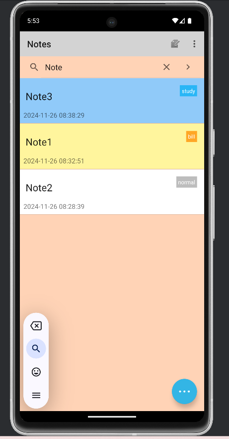

精准查询

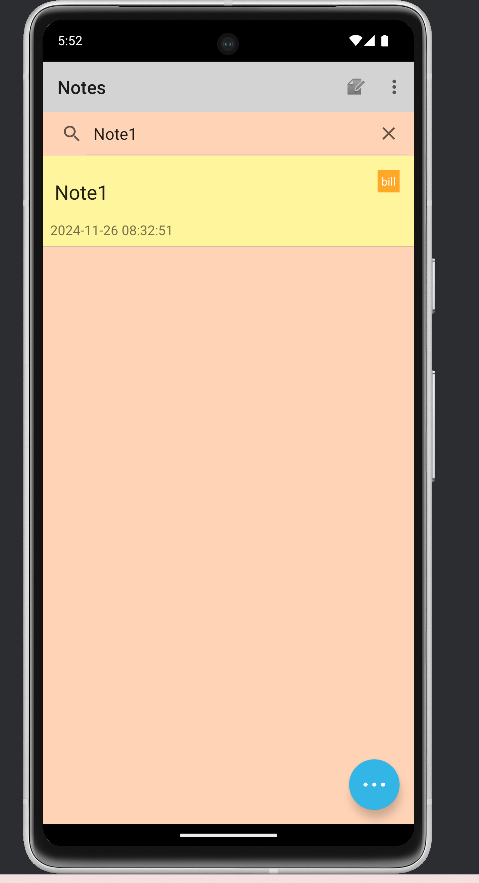
## 三 笔记分类添加标签
### 1、在数据库中添加tag列
这里我们选择删除原有数据库，重新创建数据库的方法。
#### (1)首先运行虚拟机，在Device Explorer中，将data/data/com.android.example.notepad/data/databases的整个databases文件夹删除
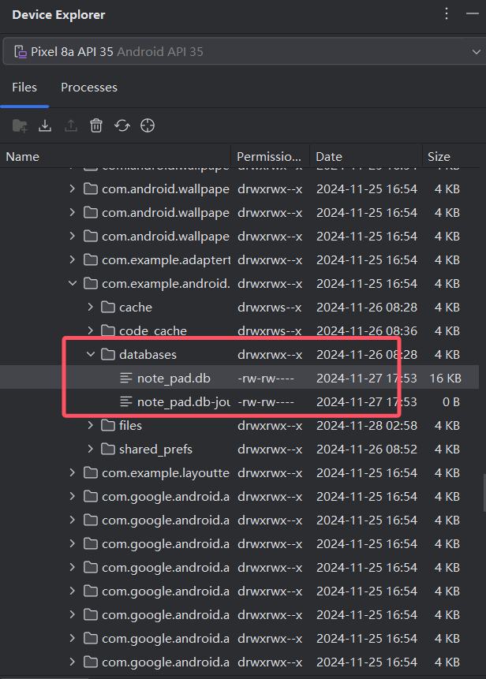
#### (2)对契约类添加tag
在NotePad类中的Notes中添加参数COLUMN_NAME_TAG，值为数据库tag的列名
```
public static final String COLUMN_NAME_TAG = "tag";
```
#### (3)对NotePadProvider进行修改以添加tag列
##### 创建数据库时添加tag列
在onCreate()方法创建数据库时，新增一个标签列，`NotePad.Notes.COLUMN_NAME_TAG`，数据类型为"TEXT"
```
@Override
public void onCreate(SQLiteDatabase db) {
    db.execSQL("CREATE TABLE " + NotePad.Notes.TABLE_NAME + " ("
            + NotePad.Notes._ID + " INTEGER PRIMARY KEY,"
            + NotePad.Notes.COLUMN_NAME_TITLE + " TEXT,"
            + NotePad.Notes.COLUMN_NAME_NOTE + " TEXT,"
            + NotePad.Notes.COLUMN_NAME_TAG + " TEXT," // 新增标签列
            + NotePad.Notes.COLUMN_NAME_CREATE_DATE + " INTEGER,"
            + NotePad.Notes.COLUMN_NAME_MODIFICATION_DATE + " INTEGER"
            + ");");
}
```
##### sNotesProjectionMap及READ_NOTE_PROJECTION更新
在静态代码块对sNotesProjectionMap进行实例化的过程中，添加COLUMN_NAME_TAG，用于获取tag列
```
sNotesProjectionMap.put(
    NotePad.Notes.COLUMN_NAME_TAG,
    NotePad.Notes.COLUMN_NAME_TAG);
```
READ_NOTE_PROJECTION中也添加`NotePad.Notes.COLUMN_NAME_TAG`，但是由于该应用未设计与其它应用数据交互，所以该步骤不影响
```
private static final String[] READ_NOTE_PROJECTION = new String[] {
        NotePad.Notes._ID,               // Projection position 0, the note's id
        NotePad.Notes.COLUMN_NAME_NOTE,  // Projection position 1, the note's content
        NotePad.Notes.COLUMN_NAME_TITLE, // Projection position 2, the note's title
        NotePad.Notes.COLUMN_NAME_TAG, // Projection position 3, the note's tag
};
```
##### insert方法更新
然后在insert()方法中，在创建新纪录时添加tag的数据
```
if (!values.containsKey(NotePad.Notes.COLUMN_NAME_TAG)) {
    values.put(NotePad.Notes.COLUMN_NAME_TAG, "normal"); // 默认值为“normal”
}
```
### 2、为NoteEditor添加标签选择
#### (1)在NoteEditor布局中添加标签选择
为了能够让用户在编辑笔记时选择标签，在NoteEditor中添加一个spinner以供用户选择标签
```
<Spinner
    android:id="@+id/tag_spinner"
    android:layout_width="match_parent"
    android:layout_height="wrap_content"
    android:entries="@array/tags_array"
    android:prompt="@string/select_tag" />
```
#### (2)在NoteEditor中添加对spinner的交互逻辑
##### 通过ArrayAdapter对spinner的数据源进行配置，将预设的标签都设置到spinner里面。
首先在values/strings.xml中添加一个tag的数组tags_array
```
<string-array name="tags_array">
        <item>normal</item>
        <item>bill</item>
        <item>study</item>
</string-array>
<string name="select_tag">Select a tag</string>
```
装配ArrayAdapter，其中，`android.R.layout.simple_spinner_item`和`android.R.layout.simple_spinner_dropdown_item`为安卓自带的布局，Spinner 控件的布局资源，它们用于选项显示和创建下拉列表的样式。
```
ArrayAdapter<CharSequence> adapter = ArrayAdapter.createFromResource(
    this,
    R.array.tags_array,
    android.R.layout.simple_spinner_item
);
adapter.setDropDownViewResource(android.R.layout.simple_spinner_dropdown_item);
tagSpinner.setAdapter(adapter);
```
##### 将spinner选择的标签和其它数据一起包装添加到数据库中

在onPause()中，对数据进行包装，调用updateNote()函数，在这里对updateNote()函数进行更改，加入tag的数据，一起存入数据库

在onPause()方法和onOptionsItemSelected()中获取spinner选取的tag

```
Spinner tagSpinner = findViewById(R.id.tag_spinner);
String selectedTag = (String) tagSpinner.getSelectedItem();
```
在调用updateNote()的方法中都修改传入tag

```
updateNote(text, null, selectedTag);
updateNote(text, tittle, selectedTag);
```

然后在updateNote()方法中加入tag数据

```
values.put(NotePad.Notes.COLUMN_NAME_TAG, selectedTag);
```

#### 结果
启动app后，通过App Inspection中的Database Inspector我们可以直观看到数据库notes表内有tag列

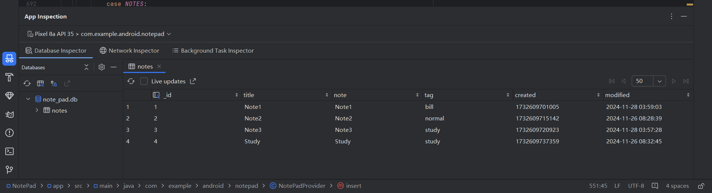

## 四 UI美化
### 1、在NotesList页面添加浮动按钮实现菜单栏的作用
#### (1)在noteList_layout.xml布局中加入浮动按钮
浮动菜单包括一个添加按钮，一个粘贴按钮，一个背景色按钮，点击背景色按钮还会弹出一个子颜色菜单。将整个主内容布局（toolbar、searchview、listview）的线性布局，包裹在一个帧布局里面，然后再将浮动菜单设置在一个帧布局内，浮动按钮用一个垂直线性布局设计。颜色菜单用一个水平线性布局设计。
```
 <!-- 浮动按钮部分 -->
    <FrameLayout
        android:layout_width="match_parent"
        android:layout_height="match_parent">

        <com.google.android.material.floatingactionbutton.FloatingActionButton
            android:id="@+id/mainFab"
            android:layout_width="wrap_content"
            android:layout_height="wrap_content"
            android:layout_gravity="bottom|end"
            android:layout_margin="16dp"
            android:src="@drawable/ic_menu_more"
            android:tint="@android:color/white"
            app:backgroundTint="@android:color/holo_blue_light" />

        <!-- 子按钮容器 -->
        <LinearLayout
            android:id="@+id/subMenu"
            android:layout_width="wrap_content"
            android:layout_height="wrap_content"
            android:orientation="vertical"
            android:layout_gravity="bottom|end"
            android:layout_margin="16dp"
            android:scaleX="0"
            android:scaleY="0"
            android:visibility="gone">

            <com.google.android.material.floatingactionbutton.FloatingActionButton
                android:id="@+id/fabOption_add"
                android:layout_width="wrap_content"
                android:layout_height="wrap_content"
                android:src="@drawable/ic_menu_add"
                android:tint="@android:color/white"
                android:layout_marginBottom="10dp"
                app:backgroundTint="@android:color/holo_green_light" />

            <com.google.android.material.floatingactionbutton.FloatingActionButton
                android:id="@+id/fabOption_paste"
                android:layout_width="wrap_content"
                android:layout_height="wrap_content"
                android:src="@drawable/ic_menu_paste"
                android:tint="@android:color/white"
                android:layout_marginBottom="10dp"
                app:backgroundTint="@android:color/holo_green_dark" />

            <com.google.android.material.floatingactionbutton.FloatingActionButton
                android:id="@+id/fabOption_color"
                android:layout_width="wrap_content"
                android:layout_height="wrap_content"
                android:src="@drawable/ic_menu_background"
                android:tint="@android:color/white"
                android:layout_marginBottom="70dp"
                app:backgroundTint="@android:color/holo_orange_light" />
        </LinearLayout>

        <!-- 单独的颜色菜单 -->
        <LinearLayout
            android:id="@+id/colorMenu"
            android:layout_width="wrap_content"
            android:layout_height="wrap_content"
            android:orientation="horizontal"
            android:layout_gravity="bottom|end"
            android:layout_marginEnd="80dp"
            android:layout_marginBottom="86dp"
            android:scaleX="0"
            android:scaleY="0"
            android:visibility="gone">

        <com.google.android.material.floatingactionbutton.FloatingActionButton
            android:id="@+id/colorButton1"
            android:layout_width="wrap_content"
            android:layout_height="wrap_content"
            app:backgroundTint="#A8E6CF"
            android:tint="@android:color/white"
            app:elevation="2dp"/>

        <com.google.android.material.floatingactionbutton.FloatingActionButton
            android:id="@+id/colorButton2"
            android:layout_width="wrap_content"
            android:layout_height="wrap_content"
            app:backgroundTint="#FFD3B6"
            android:tint="@android:color/white"
            app:elevation="2dp"/>

        <com.google.android.material.floatingactionbutton.FloatingActionButton
            android:id="@+id/colorButton3"
            android:layout_width="wrap_content"
            android:layout_height="wrap_content"
            app:backgroundTint="#D4C5F9"
            android:tint="@android:color/white"
            app:elevation="2dp"/>

        <com.google.android.material.floatingactionbutton.FloatingActionButton
            android:id="@+id/colorButton4"
            android:layout_width="wrap_content"
            android:layout_height="wrap_content"
            app:backgroundTint="#ECEFF1"
            android:tint="@android:color/white"
            app:elevation="2dp"/>

        <com.google.android.material.floatingactionbutton.FloatingActionButton
            android:id="@+id/colorButton5"
            android:layout_width="wrap_content"
            android:layout_height="wrap_content"
            app:backgroundTint="#FFFFFF"
            android:tint="@android:color/white"
            app:elevation="2dp"/>
    </LinearLayout>
```
最终布局效果如图，右下角有一个浮动按钮，点击可展开菜单
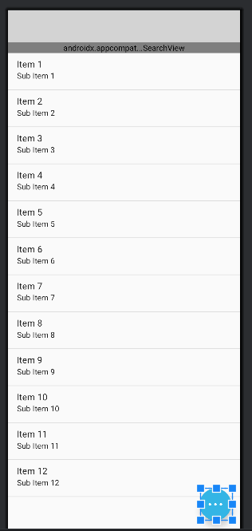
#### (2)对浮动按钮的点击交互设置
##### 对mainFab按钮添加展开子菜单的交互
对mainFab主按钮添加展开子菜单subMenu的交互，通过animate()方法实现从小到大的显示交互和从大到小的隐藏交互
```
mainFab.setOnClickListener(v -> toggleSubMenu());

private void toggleSubMenu() {
        if (isMenuOpen) {
            // 子菜单向下缩小并收起
            subMenu.animate()
                    .translationY(mainFab.getHeight()) // 移动靠近主按钮
                    .scaleX(0)       // 水平缩小到 0
                    .scaleY(0)       // 垂直缩小到 0
                    .setDuration(300) // 动画时长
                    .setListener(new AnimatorListenerAdapter() {
                        @Override
                        public void onAnimationEnd(Animator animation) {
                            subMenu.setVisibility(View.GONE); // 动画结束后隐藏
                        }
                    });
        } else {
            // 子菜单向上展开并放大
            subMenu.setVisibility(View.VISIBLE); // 显示视图
            subMenu.setScaleX(0); // 初始化为缩小状态
            subMenu.setScaleY(0);
            subMenu.setTranslationY(mainFab.getHeight()); // 从主按钮位置开始

            subMenu.animate()
                    .translationY(0) // 向上移动距离等于自身高度
                    .scaleX(1)       // 水平放大到 1
                    .scaleY(1)       // 垂直放大到 1
                    .setDuration(300) // 动画时长
                    .setListener(null); // 无额外操作
        }
        isMenuOpen = !isMenuOpen; // 切换菜单状态
    }
```
##### 为子菜单按钮添加交互
为新增按钮和粘贴按钮增加startActivity()方法以打开编辑页面和粘贴页面，同时toggleSubMenu()收起主菜单。
```
findViewById(R.id.fabOption_add).setOnClickListener(v -> handleOption_Add());
findViewById(R.id.fabOption_paste).setOnClickListener(v -> handleOption_Paste());

private void handleOption_Add() {
        toggleSubMenu();   // 收起主菜单
        startActivity(new Intent(Intent.ACTION_INSERT, getIntent().getData()));
    }

    private void handleOption_Paste() {
        toggleSubMenu();   // 收起主菜单
        startActivity(new Intent(Intent.ACTION_PASTE, getIntent().getData()));
    }
```
##### 为背景颜色按钮添加交互
首先为背景颜色按钮添加展开颜色选择菜单的交互，不同的是这次是往左边展开，所以采用的是translationX()和setTranslationX()
```
colorFab.setOnClickListener(v -> toggleColorMenu());

private void toggleColorMenu() {
        if (isColorMenuOpen) {
            colorMenu.animate()
                    .translationX(colorFab.getWidth())
                    .scaleX(0)
                    .scaleY(0)
                    .setDuration(300)
                    .setListener(new AnimatorListenerAdapter() {
                        @Override
                        public void onAnimationEnd(Animator animation) {
                            colorMenu.setVisibility(View.GONE);
                        }
                    });
        } else {
            colorMenu.setVisibility(View.VISIBLE);
            colorMenu.setScaleX(0);
            colorMenu.setScaleY(0);
            colorMenu.setTranslationX(colorFab.getWidth());

            colorMenu.animate()
                    .translationX(0)
                    .scaleX(1)
                    .scaleY(1)
                    .setDuration(300)
                    .setListener(null);
        }
        isColorMenuOpen = !isColorMenuOpen;
    }
```
##### 为颜色按钮添加交互
添加了5种颜色，按照标签颜色的情况下设计了较为柔和的背景颜色：浅绿色，淡橙色，淡紫色，淡灰色，白色。然后为每个颜色按钮都设置点击监听器，通过setBackgroundColor为整个listview和searchview都设置背景颜色，并且将当前颜色保存到SharedPreferences，然后收起颜色菜单和主菜单。
```
setupColorButtons();

private void setupColorButtons() {
        int[] buttonIds = {R.id.colorButton1, R.id.colorButton2, R.id.colorButton3, R.id.colorButton4, R.id.colorButton5};
        int[] colors = {
                Color.parseColor("#A8E6CF"),
                Color.parseColor("#FFD3B6"),
                Color.parseColor("#D4C5F9"),
                Color.parseColor("#ECEFF1"),
                Color.WHITE
        };

        for (int i = 0; i < buttonIds.length; i++) {
            int color = colors[i];
            findViewById(buttonIds[i]).setOnClickListener(v -> {
                // 设置背景颜色
                lv_notesList.setBackgroundColor(color);
                searchView.setBackgroundColor(color);

                // 保存背景颜色到 SharedPreferences
                saveBackgroundColor(color);

                // 收起 colorMenu 和 subMenu
                toggleColorMenu(); // 收起颜色菜单
                toggleSubMenu();   // 收起主菜单
            });
        }
    }
```
保存背景颜色到 SharedPreferences
```
private void saveBackgroundColor(int color) {
        SharedPreferences preferences = getSharedPreferences("app_preferences", MODE_PRIVATE);
        SharedPreferences.Editor editor = preferences.edit();
        editor.putInt("background_color", color); // 将背景颜色保存为整数
        editor.apply();
    }
```
为了能够让app启动时自动维持上次选择的背景颜色，restoreBackgroundColor()实现。并在onCreate()中调用`restoreBackgroundColor();`
```
private void restoreBackgroundColor() {
        SharedPreferences preferences = getSharedPreferences("app_preferences", MODE_PRIVATE);
        int savedColor = preferences.getInt("background_color", Color.WHITE); // 默认白色
        lv_notesList.setBackgroundColor(savedColor);
        searchView.setBackgroundColor(savedColor);
    }
```
#### 结果

点击可展开主菜单，点击背景颜色按钮可展开颜色菜单，点击背景颜色按钮可更改背景颜色

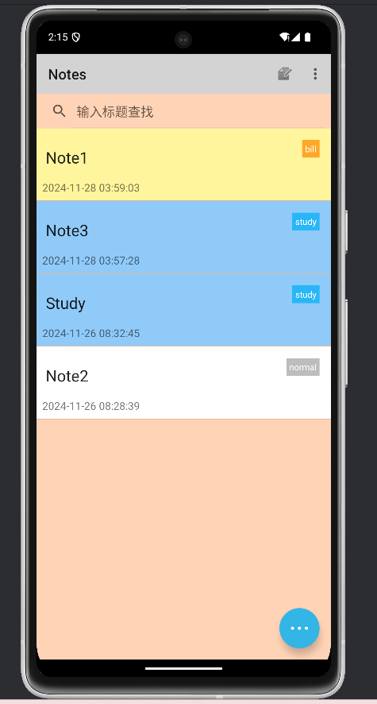

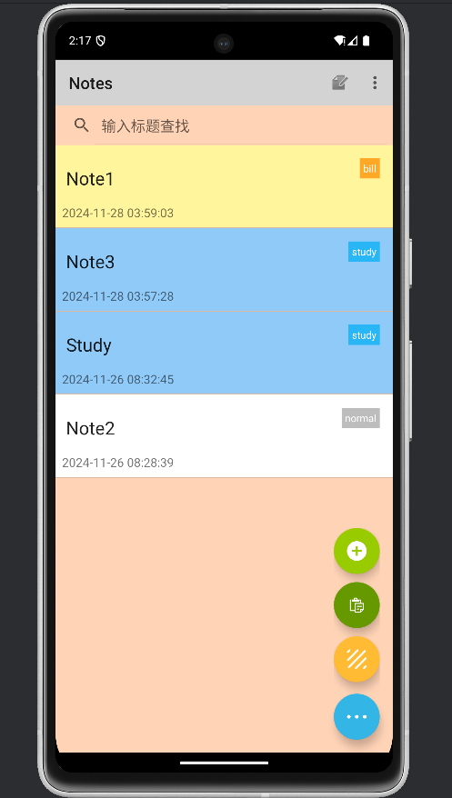

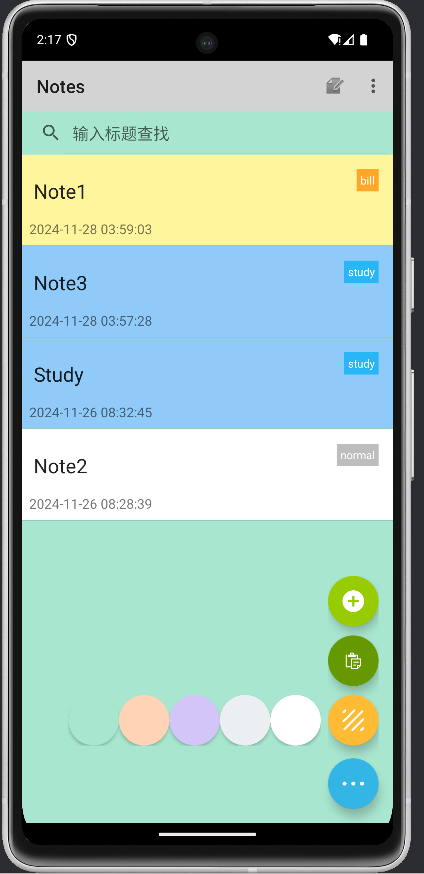

### 2、为list item添加标签以及背景色
##### 为notelist_item.xml布局添加标签
设置帧布局，包括tittle和time的线性布局以及一个TextView显示标签
```
<TextView
        android:id="@+id/tag_label"
        android:layout_width="wrap_content"
        android:layout_height="wrap_content"
        android:layout_gravity="top|end"
        android:background="@color/tagColor"
        android:padding="4dp"
        android:text="Tag"
        android:textSize="12sp"
        android:textColor="@android:color/white"
        android:layout_margin="8dp" />
```

##### 设置一个新的Adapter并命名为MyCursorAdapter
为了能够更改list item的背景颜色，我们需要设计一个adapter来装配我们的数据，然后在其中设置逻辑来更改背景颜色，主要实现方法在于bindView()。
通过tag更改list item背景颜色：
```
int tagIndex = cursor.getColumnIndex(NotePad.Notes.COLUMN_NAME_TAG);
String tag = cursor.getString(tagIndex);

// 根据标签设置背景颜色
int backgroundColor;
switch (tag) {
    case "bill":
        backgroundColor = Color.parseColor("#FFF59D"); // 浅黄色
        break;
    case "study":
        backgroundColor = Color.parseColor("#90CAF9"); // 浅蓝色
        break;
    default: // normal 或其他
        backgroundColor = Color.WHITE;
        break;
}
view.setBackgroundColor(backgroundColor);
```
然后对每个数据进行绑定，这里举例tag
```
TextView tagView = view.findViewById(R.id.tag_label);
int tagIndex = cursor.getColumnIndex(NotePad.Notes.COLUMN_NAME_TAG);
String tag = cursor.getString(tagIndex);
if (tag != null){
	tagView.setText(tag);
}

//tag较其它的不同处，设计了背景颜色的不同
switch (tag) {
    case "bill":
        tagView.setBackgroundColor(Color.parseColor("#FFA726")); // 橙色
        break;
    case "study":
        tagView.setBackgroundColor(Color.parseColor("#29B6F6")); // 蓝色
        break;
    case "normal":
    default:
        tagView.setBackgroundColor(Color.parseColor("#BDBDBD")); // 灰色
        break;
}
```
#### 结果

最终效果：右上角有tag标签，且item的背景颜色根据标签不同而不同


### 3、为note editor添加不同标签下的不同背景信纸
#### 前面我们已经为editor添加了spinner来选择标签，通过这个我们设计其背景颜色
在NoteEditor中的onCreate()方法为spinner添加选择监听器，不同标签选择，编辑的信纸的背景颜色也不同
```
tagSpinner.setOnItemSelectedListener(new AdapterView.OnItemSelectedListener() {
            @Override
            public void onItemSelected(AdapterView<?> parent, View view, int position, long id) {
                // 根据标签改变背景颜色
                String selectedTag = (String) parent.getItemAtPosition(position);
                setEditorBackground(selectedTag);
            }

            @Override
            public void onNothingSelected(AdapterView<?> parent) {
                // 默认选择第一个标签（normal）
                setEditorBackground("normal");
            }
        });
        
private void setEditorBackground(String tag) {
        View editor = findViewById(R.id.note);
        int backgroundColor;

        switch (tag) {
            case "bill":
                backgroundColor = Color.parseColor("#FFF59D"); // 浅黄色
                break;
            case "study":
                backgroundColor = Color.parseColor("#90CAF9"); // 浅蓝色
                break;
            default: // normal
                backgroundColor = Color.WHITE; // 白色
                break;
        }

        editor.setBackgroundColor(backgroundColor);
}
```
#### 结果
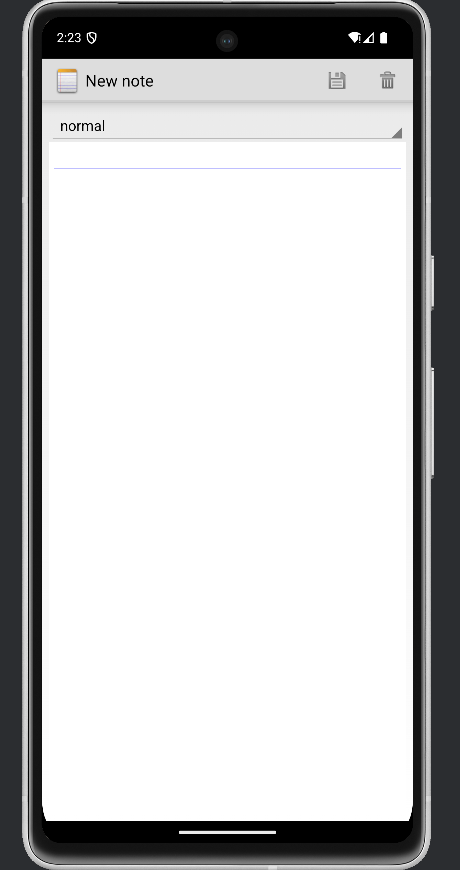
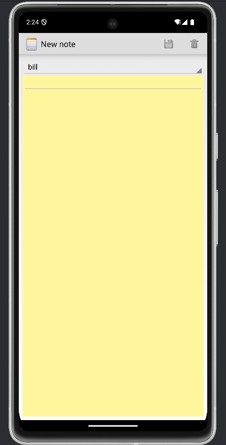
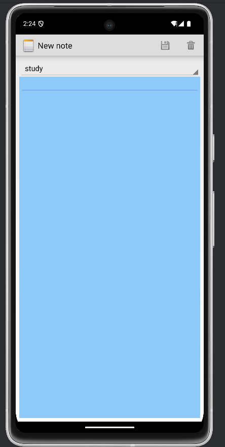